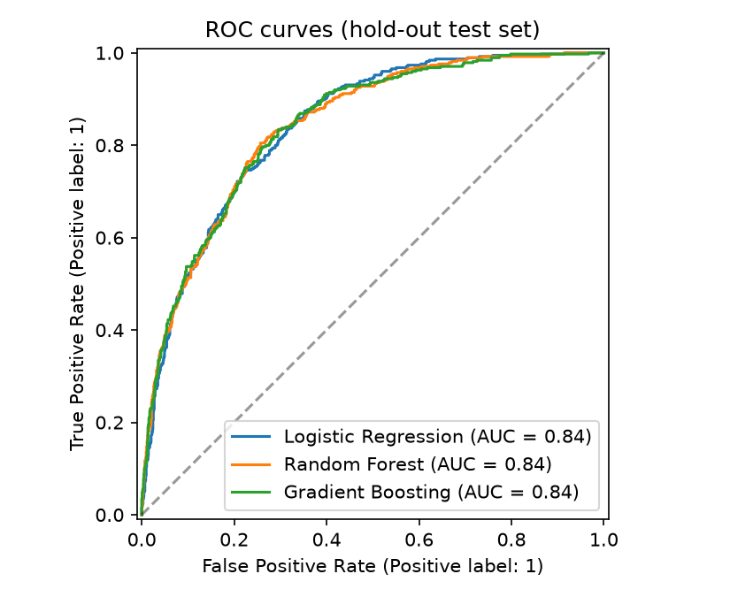
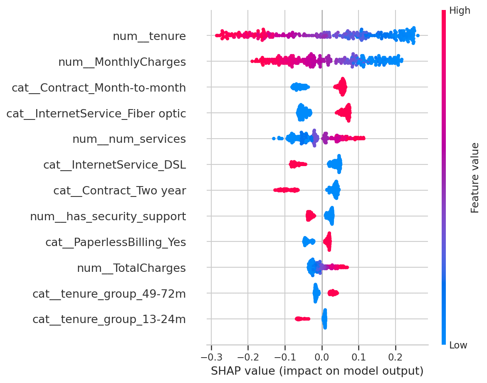

# Customer Churn Analysis - Summary Report

**Author:** Your Name

## 1. Objective
Identify telecom customers at risk of cancelling, understand why, and recommend retention actions.

## 2. Data
7,043 customers, 20 features (demographics, services, contract, billing) and a churn label. Overall churn is **26.5%**.
Cleaning: 11 blank `TotalCharges` values belonged to customers with tenure 0 (not yet billed) and were set to 0. No duplicates or numeric outliers were found. Seven automated validation checks pass.

## 3. What drives churn
| Segment | Churn rate |
|---|---|
| Month-to-month contract | 43% |
| Two-year contract | 3% |
| First 12 months of tenure | 47% |
| 49-72 months of tenure | 9.5% |
| No tech support | 42% |
| With tech support | 15% |
| Fiber optic internet | 42% |
| DSL internet | 19% |
| Electronic check payment | 45% |
| Other payment methods | 17% |

Chi-square tests confirm that contract type, online security, tech support, internet service and payment method have the strongest associations with churn (Cramer's V 0.30-0.41). Gender and phone service are not significant.

## 4. Models
Logistic Regression, Random Forest and Gradient Boosting were compared with 5-fold stratified cross-validation inside a scikit-learn pipeline (class weights for imbalance).

| Model | CV ROC-AUC | Test ROC-AUC |
|---|---|---|
| Logistic Regression | 0.846 | 0.842 |
| Random Forest | 0.846 | 0.842 |
| Gradient Boosting | 0.846 | 0.842 |

The models tie, so **Logistic Regression** was chosen for interpretability. On the test set it catches **79% of churners** (recall) with **50% precision** (F1 0.62) at the default 0.5 threshold.

**Decision threshold:** a missed churner costs more than a wasted retention offer. Using *assumed* costs (500 per lost customer, 50 per offer), the notebook finds the lowest total cost at a threshold of 0.20, which raises recall to about 96% at about 39% precision. These costs are illustrative; a real team should use its own figures.

## 5. Recommendations
1. Offer incentives to move month-to-month customers to 1-2 year contracts, especially in their first year.
2. Bundle tech support and online security free for new customers.
3. Review fiber-optic pricing and service quality; it has the highest churn of the internet products.
4. Encourage automatic payment instead of electronic check.
5. Run a proactive outreach campaign on customers the model flags as High risk (`python -m src.predict`).

## 6. Limitations
Snapshot data (no time trend), associations not causation, assumed costs, and strongly correlated features (e.g., monthly charges vs. services) mean coefficients should be interpreted with care. Validate on the company's own data before deployment.